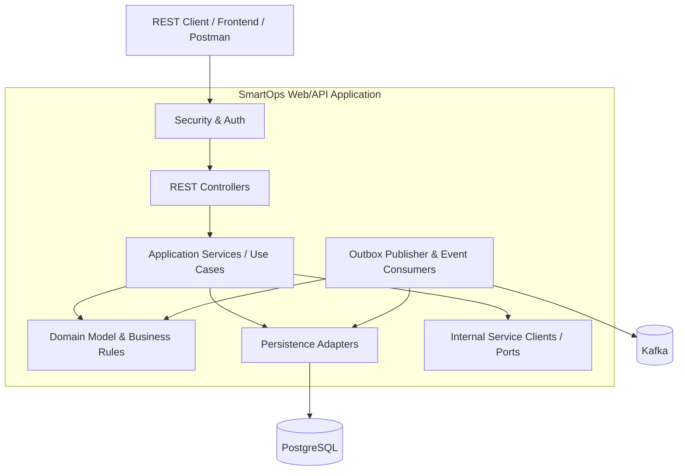
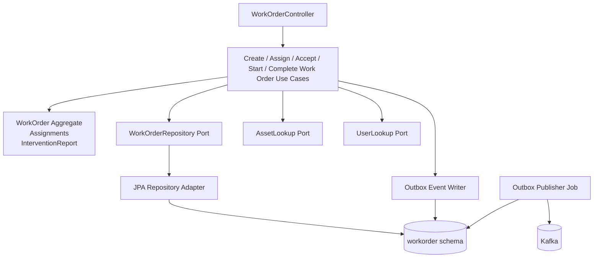

# Component Diagram

This document describes the internal component structure of the SmartOps Web/API Application using a C4-style level 3 view.

## Architectural style

Each business module follows a clean, layered structure:
- **API layer** for controllers and external DTOs
- **Application layer** for use cases and orchestration
- **Domain layer** for business rules and aggregates
- **Infrastructure layer** for persistence, messaging, and external clients

## Global component view

## Business-module component overview

```mermaid
flowchart LR
    subgraph Identity
        IApi[API]
        IApp[Application]
        IDomain[Domain]
        IInfra[Infrastructure]
    end

    subgraph Customer
        CApi[API]
        CApp[Application]
        CDomain[Domain]
        CInfra[Infrastructure]
    end

    subgraph Asset
        AApi[API]
        AApp[Application]
        ADomain[Domain]
        AInfra[Infrastructure]
    end

    subgraph WorkOrder
        WApi[API]
        WApp[Application]
        WDomain[Domain]
        WInfra[Infrastructure]
    end

    subgraph Billing
        BApi[API]
        BApp[Application]
        BDomain[Domain]
        BInfra[Infrastructure]
    end

    subgraph Notification
        NApi[API]
        NApp[Application]
        NDomain[Domain]
        NInfra[Infrastructure]
    end

    subgraph Audit
        UApi[API]
        UApp[Application]
        UDomain[Domain]
        UInfra[Infrastructure]
    end

    IApi --> IApp --> IDomain --> IInfra
    CApi --> CApp --> CDomain --> CInfra
    AApi --> AApp --> ADomain --> AInfra
    WApi --> WApp --> WDomain --> WInfra
    BApi --> BApp --> BDomain --> BInfra
    NApi --> NApp --> NDomain --> NInfra
    UApi --> UApp --> UDomain --> UInfra
```

## Workorder module detailed component view

## Key design rules

### Rule 1
The domain layer must not depend on Spring MVC, Spring Data, Kafka, or database entities.

### Rule 2
Cross-module interaction should happen through ports, clients, or events, not direct persistence access.

### Rule 3
Each module should remain extractable into an independent service with minimal redesign.

### Rule 4
Outbox-based event publishing is the preferred pattern for reliable asynchronous integration.
