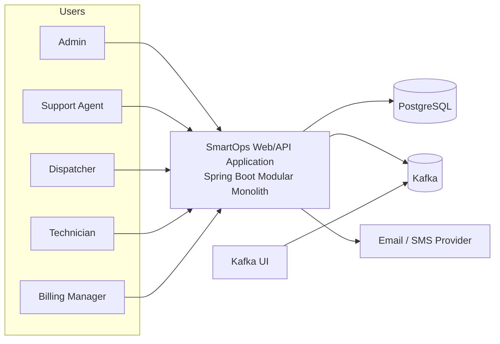
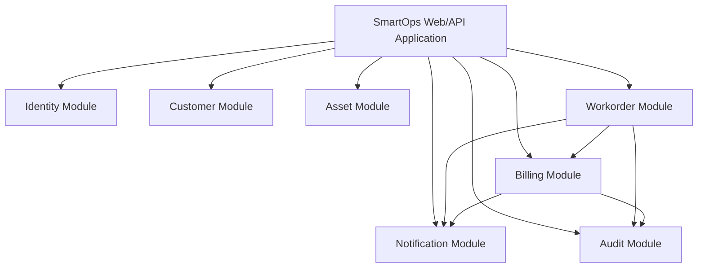

# Container Diagram

This document describes the main runtime containers of the Smart Operations Platform using a C4-style level 2 view.

## Purpose

In the current implementation phase, Smart Operations Platform runs as a modular monolith. Internal modules are organized so that they can later be extracted into separate microservices.

## Containers

### 1. SmartOps Web/API Application
Single Spring Boot application that hosts the internal bounded-context modules:
- identity
- customer
- asset
- workorder
- billing
- notification
- audit

Responsibilities:
- expose REST APIs
- enforce authentication and authorization
- orchestrate application use cases
- persist transactional state
- publish domain events through the outbox and Kafka
- consume events for downstream workflows

### 2. PostgreSQL
Primary relational database.

Responsibilities:
- store transactional business data
- host one schema per bounded context
- support Flyway migrations
- provide strong consistency inside service boundaries

### 3. Kafka
Messaging backbone for asynchronous communication.

Responsibilities:
- transport business events
- decouple producers from consumers
- support event-driven workflows
- enable future service extraction

### 4. Kafka UI
Local development and debugging tool.

Responsibilities:
- inspect topics
- inspect messages
- support local event-driven development

### 5. Notification Provider
External integration used in later phases.

Responsibilities:
- deliver emails or SMS messages
- act as external adapter behind notification module

## Container Diagram

## Internal runtime modules inside the application

## Evolution path

### Current state
- one deployable application
- one PostgreSQL database
- multiple schemas
- Kafka for asynchronous workflows

### Target state
- one deployable service per bounded context
- database-per-service or schema-per-service
- same event-driven integration style
