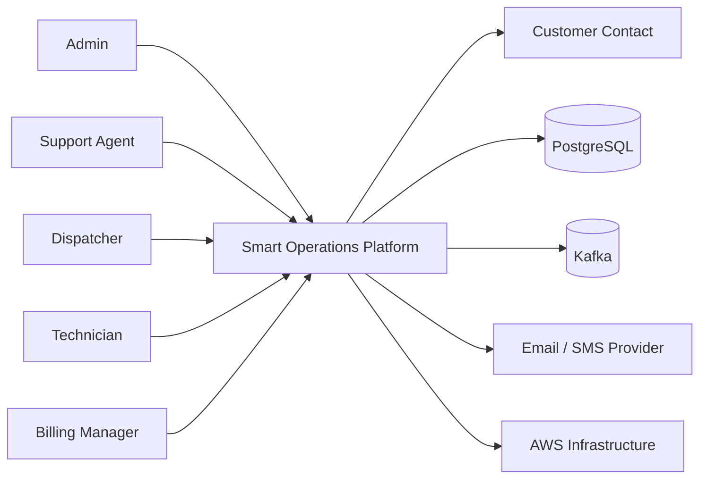

# Context Diagram

This document describes the Smart Operations Platform in its wider environment using a C4-style level 1 view.

## Purpose

The Smart Operations Platform is a backend platform for managing maintenance and field-service operations for customer-owned equipment. It supports customer management, site management, asset registration, work-order lifecycle management, technician assignment, billing, notifications, and auditability.

## Actors and External Systems

### Human actors
- **Admin** manages users, roles, and platform configuration.
- **Support Agent** creates customers, sites, assets, and work orders.
- **Dispatcher** assigns technicians and coordinates interventions.
- **Technician** accepts, starts, and completes assigned work orders.
- **Billing Manager** reviews invoices and billing status.
- **Customer Contact** receives operational and billing notifications.

### External systems
- **PostgreSQL** stores transactional data for all bounded contexts in the modular monolith phase.
- **Kafka** transports domain events between producing and consuming modules.
- **Email/SMS Provider** delivers outbound notifications in later phases.
- **AWS Platform** hosts the application and its managed infrastructure in cloud deployments.

## Context Diagram

## Responsibilities of the Platform

The Smart Operations Platform:
- authenticates and authorizes users
- manages customer organizations and their sites
- registers and tracks serviceable assets
- manages work-order lifecycle from creation to completion
- produces and consumes business events
- generates invoices after billable work is completed
- records audit history of important actions
- triggers operational and billing notifications

## Notes

### Current implementation path
The initial implementation is a **modular monolith** with a single deployable application and strict internal module boundaries.

### Future target state
The target architecture is a **microservices-based distributed system** where each bounded context can evolve into an independent deployable service.
