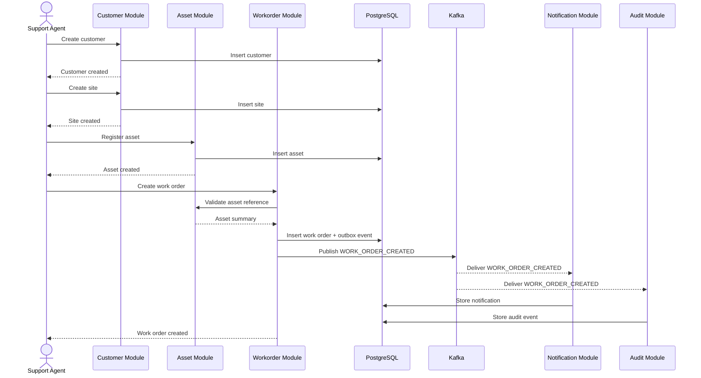
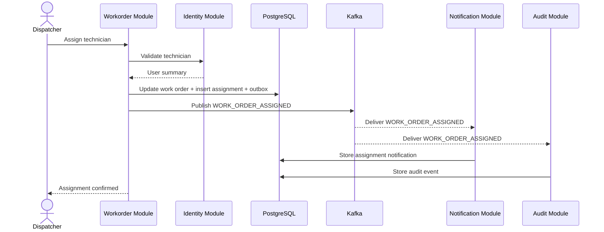
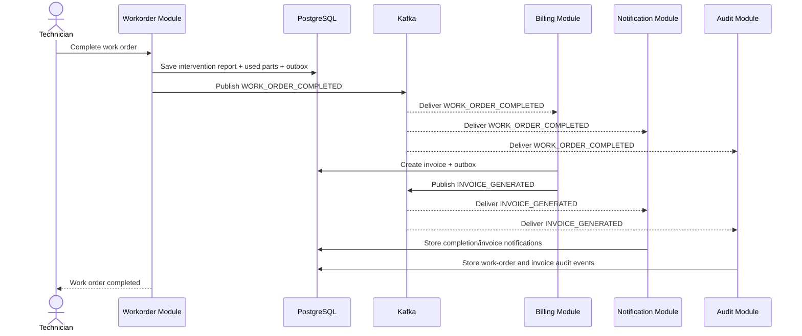
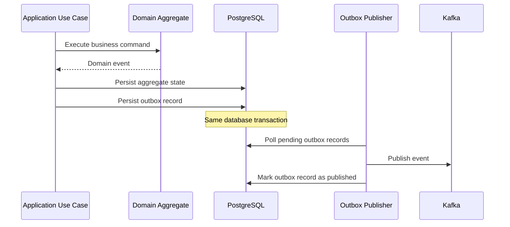

# Sequence Diagrams

This document captures the first important business workflows of the SmartOps Platform.

## 1. Create customer, site, asset, and work order

## 2. Assign technician to work order

## 3. Complete work order and generate invoice

## 4. Outbox publishing pattern

## Notes

### Why sequence diagrams matter
These diagrams make it easier to explain:
- where business rules run
- when data is committed
- when events are emitted
- how downstream modules react

### Recommended first implementation focus
Start with the workflows above before documenting additional edge cases such as cancellation, retries, and failure handling.
