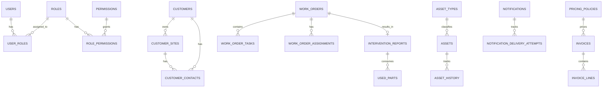
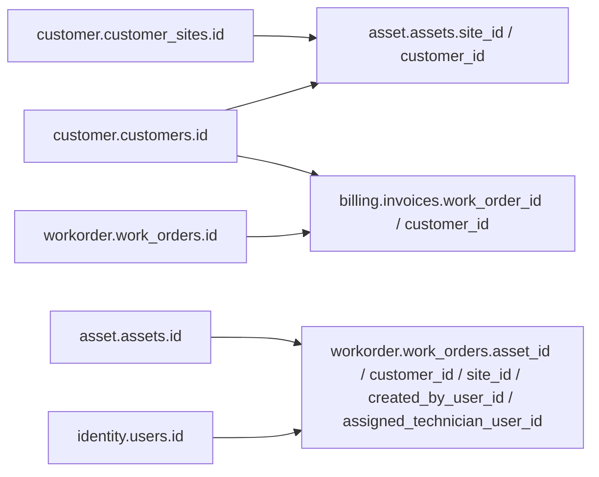
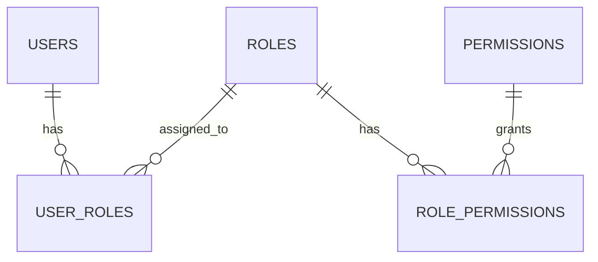
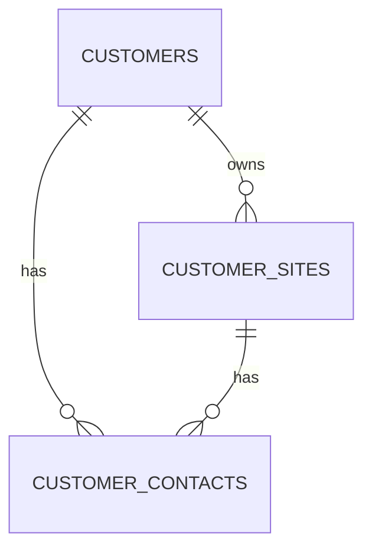
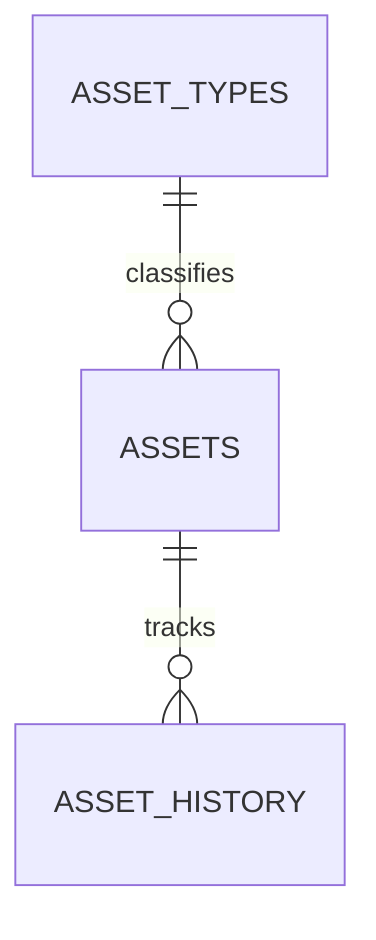
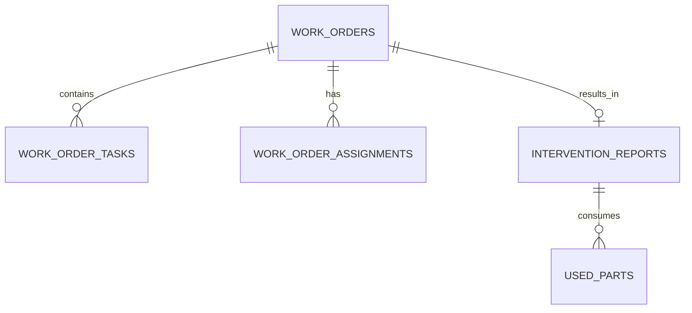
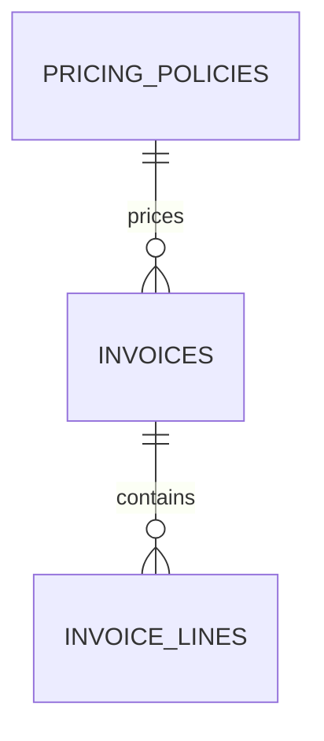
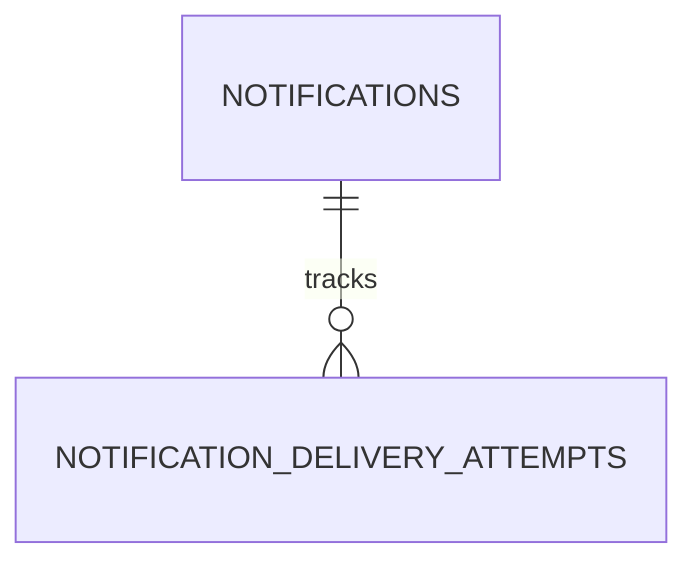
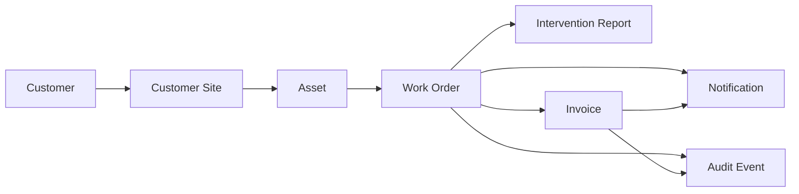

# Database ER Overview

This document provides the Entity-Relationship overview for the Smart Operations Platform.

It is intended as a readable architectural view of the data model rather than a full physical DDL specification.

The platform is designed with **schema-per-bounded-context** so that the current modular monolith can evolve cleanly into microservices.

## Database strategy

### Current implementation direction
- one PostgreSQL instance
- one logical database
- multiple schemas aligned with business modules

### Schemas
- `identity`
- `customer`
- `asset`
- `workorder`
- `billing`
- `notification`
- `audit`

### Ownership rule
Each schema owns its own tables and data lifecycle.

Cross-schema references that represent future cross-service boundaries should be treated as logical references, not as tightly coupled shared relational structures.

---

## High-level ER overview

---

## Cross-context logical references

These relationships are important conceptually, but in a microservice-ready design they should not become hard database dependencies across service boundaries.

These should be validated at the application level through service contracts, not through cross-service foreign keys in the long-term architecture.

---

## Schema-by-schema overview

## 1. Identity schema

Purpose:
- authentication
- user and role administration
- authorization metadata

Main tables:
- `identity.users`
- `identity.roles`
- `identity.permissions`
- `identity.user_roles`
- `identity.role_permissions`

### Key relationships

### Notes
- `users` is the main identity aggregate
- `roles` support coarse-grained authorization
- `permissions` are optional for finer control later

---

## 2. Customer schema

Purpose:
- customer master data
- customer sites
- business contacts

Main tables:
- `customer.customers`
- `customer.customer_sites`
- `customer.customer_contacts`

### Key relationships

### Notes
- one customer can own many sites
- contacts can be associated with a customer, a site, or both
- customer data serves as master/reference data for downstream modules

---

## 3. Asset schema

Purpose:
- asset registry
- asset type classification
- asset history tracking

Main tables:
- `asset.asset_types`
- `asset.assets`
- `asset.asset_history`

### Key relationships

### Notes
- each asset belongs logically to a site
- `site_id` and `customer_id` are logical references
- `asset_history` stores asset lifecycle events such as registration and status change

---

## 4. Workorder schema

Purpose:
- work order lifecycle
- assignments
- intervention execution
- outbox for reliable event publication

Main tables:
- `workorder.work_orders`
- `workorder.work_order_tasks`
- `workorder.work_order_assignments`
- `workorder.intervention_reports`
- `workorder.used_parts`
- `workorder.outbox_events`

### Key relationships

### Notes
- `work_orders` is the operational core aggregate
- assignments and reports are subordinate operational records
- `outbox_events` supports reliable Kafka publication

---

## 5. Billing schema

Purpose:
- invoice generation
- invoice line storage
- pricing policy reference
- billing outbox events

Main tables:
- `billing.pricing_policies`
- `billing.invoices`
- `billing.invoice_lines`
- `billing.outbox_events`

### Key relationships

### Notes
- invoices are generated from completed work orders
- `work_order_id` is a logical reference and usually should be unique when one invoice per work order is expected
- billing can publish `INVOICE_GENERATED` through its outbox

---

## 6. Notification schema

Purpose:
- message persistence
- delivery attempts
- notification retry support

Main tables:
- `notification.notification_templates`
- `notification.notifications`
- `notification.notification_delivery_attempts`

### Key relationships

### Notes
- notifications are typically created from consumed events
- a deduplication key helps avoid duplicate records
- delivery attempts create operational traceability

---

## 7. Audit schema

Purpose:
- immutable event history
- searchable operational traceability

Main tables:
- `audit.audit_events`

### Notes
- audit is append-oriented
- `event_id` should be unique to support idempotent event consumption
- this schema is primarily fed by business events from other contexts

---

## Main logical lifecycle

The most important end-to-end data flow can be summarized like this:

---

## Recommended key constraints

### Unique constraints
Examples:
- `identity.users.username`
- `identity.users.email`
- `customer.customers.customer_number`
- `customer.customer_sites.site_number`
- `asset.assets.asset_number`
- `asset.assets.serial_number`
- `workorder.work_orders.work_order_number`
- `billing.invoices.invoice_number`
- `billing.invoices.work_order_id` when one invoice per work order is required
- `notification.notifications.deduplication_key` when used
- `audit.audit_events.event_id`

### Intra-schema foreign keys
Use real foreign keys within the same schema.

Examples:
- `customer.customer_sites.customer_id -> customer.customers.id`
- `workorder.work_order_tasks.work_order_id -> workorder.work_orders.id`
- `billing.invoice_lines.invoice_id -> billing.invoices.id`

### Cross-context references
Use logical references, not tightly coupled foreign keys, for future cross-service boundaries.

Examples:
- asset references site and customer IDs
- work order references asset, site, customer, and user IDs
- invoice references work order and customer IDs

---

## Recommended indexing strategy

The most important indexes are:

### Identity
- username
- email
- status

### Customer
- customer number
- display name
- site customer ID

### Asset
- asset number
- serial number
- site ID
- customer ID
- status

### Work order
- work order number
- asset ID
- customer ID
- status
- assigned technician
- scheduled start
- created at

### Billing
- invoice number
- work order ID
- customer ID
- status

### Notification
- recipient reference
- event type
- status
- deduplication key

### Audit
- event ID
- aggregate type
- aggregate ID
- event type
- occurred at
- correlation ID

---

## Implementation guidance

This ER overview is the conceptual map.

The detailed physical implementation should be expressed through:
- Flyway migrations
- entity mappings
- repository contracts
- application-level validation rules

Recommended implementation order:
1. identity
2. customer
3. asset
4. workorder
5. audit
6. notification
7. billing

That order aligns well with the first vertical workflow.
